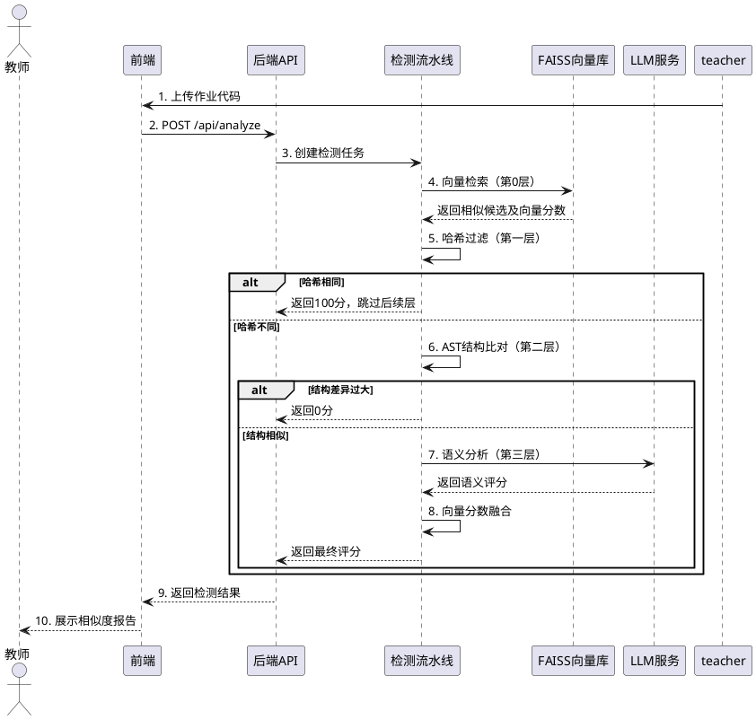
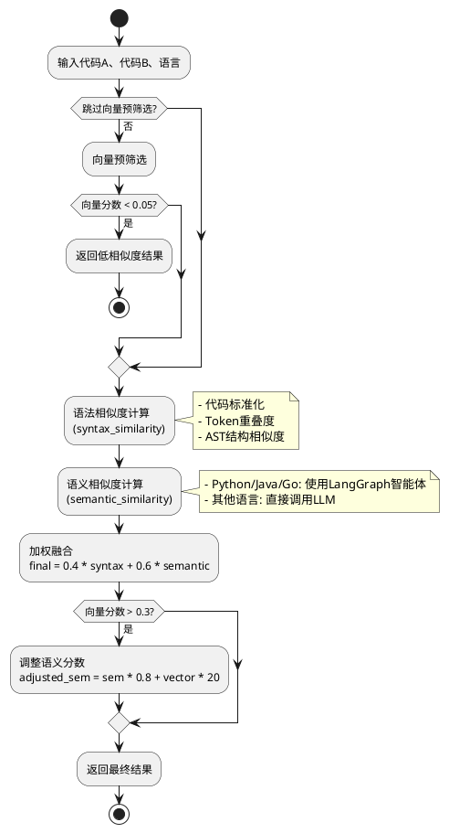

# 修正后的论文核心内容

## 第3章 系统需求分析（修正版）

### 3.2.2 四层检测功能需求（修正）

系统的核心检测流程采用**四层递进式过滤架构**，各层分工明确、协同工作：

**第0层：向量检索过滤**
- 功能：使用FAISS向量库快速检索相似代码候选
- 实现：基于HuggingFace嵌入模型将代码转换为768维向量
- 输出：向量相似度分数（0-1之间）
- 作用：为后续层级提供先验相似度信息

**第一层：哈希过滤**
- 功能：快速检测完全相同的代码
- 实现：MD5哈希算法对标准化后的代码计算指纹
- 标准化：移除注释、空白字符后比较
- 阈值：哈希完全一致则直接判定为100分

**第二层：结构比对**
- 功能：分析代码AST结构相似性
- 实现：基于tree-sitter解析生成AST结构指纹
- 输出：二元结果（0或1，结构相同或不同）
- 作用：过滤结构差异过大的代码对

**第三层：LLM语义分析**
- 功能：深度语义相似性判断
- 实现：GLM-4.5-air大语言模型
- 输入：原始代码 + 语言类型
- 输出：0-100分相似度评分 + 分析理由
- 特性：支持7种编程语言，具备重试机制

### 3.2.5 代码检测时序图（修正）



## 第4章 系统总体设计（修正版）

### 4.3 核心算法流程设计——四层过滤机制（修正）

#### 4.3.0 第0层：向量检索过滤

**算法描述：**
系统使用FAISS（Facebook AI Similarity Search）构建向量索引库。代码通过HuggingFace的all-MiniLM-L6-v2模型嵌入为384维向量（或简单关键字模型100维向量）。

**检索流程：**
1. 将查询代码编码为向量
2. 在FAISS索引中搜索最近邻（默认k=200）
3. 计算向量距离（L2距离）
4. 转换为相似度分数：similarity = max(0, 1 - distance/10)
5. 筛选同语言候选，计算平均相似度

**作用：** 为后续LLM分析提供先验相似度，并在最终评分融合中占一定权重（5%-30%）。

#### 4.3.1 第一层：哈希过滤

**算法描述：**
```python
def _quick_hash_filter(code_a, code_b):
    # 标准化：移除块注释、行注释、所有空白字符
    norm_a = re.sub(r'/\*.*?\*/', '', code_a, flags=re.DOTALL)
    norm_a = re.sub(r'#.*$|//.*$', '', norm_a, flags=re.MULTILINE)
    norm_a = re.sub(r'\s+', '', norm_a)
    
    # 计算MD5哈希
    hash_a = hashlib.md5(norm_a.encode()).hexdigest()
    hash_b = hashlib.md5(norm_b.encode()).hexdigest()
    
    return hash_a == hash_b  # 二元结果
```

**短路机制：** 若哈希相同，直接返回100分，跳过后续所有层级。

#### 4.3.2 第二层：结构比对

**算法描述：**
使用tree-sitter解析代码生成AST（抽象语法树），提取结构指纹。

```python
def _structure_similarity(ast_a, ast_b):
    fp_a = ast_a.get('structure_fingerprint')
    fp_b = ast_b.get('structure_fingerprint')
    
    if fp_a and fp_b:
        return 1.0 if fp_a == fp_b else 0.0
    return 0.0
```

**过滤逻辑：** 当前实现中阈值为0.0，即结构不同也允许进入下一层。实际可根据需求调整阈值。

#### 4.3.3 第三层：LLM语义分析

**算法描述：**
基于LangChain调用GLM-4.5-air模型进行深度语义分析。

**Prompt模板：**
```
你是资深代码审查专家。请严格从"代码功能、逻辑结构和算法意图"的角度
（忽略变量名、注释、格式等表面差异），分析以下两段{language}代码的相似性。

请按以下步骤思考：
1. 概括代码A的核心功能
2. 概括代码B的核心功能
3. 比较两者在逻辑流程、数据结构、关键算法上的异同
4. 基于以上分析，给出一个0-100的整体相似度评分

输出JSON格式：{"score": 整数, "reason": "理由", "function_summary": "功能概括"}
```

**重试机制：**
- 最大重试次数：5次
- 退避策略：2秒、5秒、10秒、20秒、30秒
- 可重试错误：429、500、502、503、504

#### 4.3.4 评分融合策略

**向量相似度权重动态调整：**
```python
if vector_similarity > 0.8:      # 极高相似度
    final_score = llm_score * 0.7 + vector_similarity * 30
elif vector_similarity > 0.6:    # 高相似度
    final_score = llm_score * 0.75 + vector_similarity * 25
elif vector_similarity > 0.4:    # 中等相似度
    final_score = llm_score * 0.85 + vector_similarity * 15
elif vector_similarity > 0.2:    # 低相似度
    final_score = llm_score * 0.95 + vector_similarity * 5
else:                            # 极低相似度
    final_score = llm_score
```

### 4.3.5 备选检测流水线（analyze_pipeline）

系统还提供另一种**三层融合检测策略**，用于批量比对场景：



**语法相似度计算细节：**
1. **代码标准化**：移除注释、压缩空白
2. **Token重叠度**：使用正则提取标识符和运算符，计算Jaccard相似度
3. **AST结构相似度**：使用tree-sitter解析，比较AST节点类型分布
4. **最终语法分**：AST占85%，Token占15%

**语义相似度计算细节：**
- Python/Java/Go：通过`agent_provider`获取`CodeDetectionAgent`，使用完整的四层过滤
- JavaScript/C/C++/C#：直接调用`_llm_semantic_for_any_language`，使用GLM-4.5-air模型

## 参考文献引用位置标注

### 第1章 绪论
- **1.1 研究背景与意义**：引用代码抄袭检测的重要性相关文献 [1-3]
- **1.2 国内外研究现状**：
  - JPlag工具 [4]
  - CP-Miner [5]
  - CodeBERT [6]
  - GraphCodeBERT [7]
  - Bellon对比实验 [8]
- **1.3 现有问题分析**：引用传统方法局限性分析 [9-10]

### 第2章 相关技术基础
- **2.1 代码相似性检测基本原理**：
  - 文本匹配算法 [11]
  - AST语法树检测 [12]
  - 代码度量检测 [13]
- **2.2 大语言模型技术**：
  - Transformer架构 [14]
  - GLM模型 [15]
  - LangChain框架 [16]
  - LangGraph框架 [17]
  - FAISS向量检索 [18]

### 第4章 系统总体设计
- **4.3 核心算法流程**：
  - tree-sitter解析器 [19]
  - MD5哈希算法 [20]
  - FAISS索引 [18]
  - 向量嵌入模型 [21]

### 第6章 实验验证
- **6.1 实验方案**：
  - 评价指标定义 [22]
  - 数据集构建方法 [23]
- **6.2 性能评估**：
  - 对比工具：JPlag [4]、Sim [24]
  - 消融实验设计 [25]

## 参考文献列表（示例）

[1] 教育部. 高等学校预防与处理学术不端行为办法[Z]. 2016.
[2] 刘挺, 等. 代码抄袭检测技术研究综述[J]. 计算机学报, 2020.
[3] 王璐, 等. 程序设计课程中代码抄袭检测方法研究[J]. 计算机教育, 2019.
[4] Prechelt L, et al. JPlag: Finding plagiarisms among a set of programs[J]. Software: Practice and Experience, 2002.
[5] Li Z, et al. CP-Miner: Finding copy-paste and related bugs in large-scale software code[J]. IEEE Transactions on Software Engineering, 2006.
[6] Feng Z, et al. CodeBERT: A pre-trained model for programming and natural languages[C]. EMNLP, 2020.
[7] Guo D, et al. GraphCodeBERT: Pre-training code representations with data flow[C]. ICLR, 2021.
[8] Bellon S, et al. Comparison and evaluation of clone detection tools[J]. IEEE Transactions on Software Engineering, 2007.
[9] Roy C K, et al. A survey on software clone detection research[J]. Queen's School of Computing TR, 2007.
[10] Rattan D, et al. Software clone detection: A systematic review[J]. Information and Software Technology, 2013.
[11] Johnson J H. Substring matching for clone detection and change tracking[C]. ICSM, 1994.
[12] Baxter I D, et al. Clone detection using abstract syntax trees[C]. ICSM, 1998.
[13] Mayrand J, et al. Experiment on the automatic detection of function clones in a software system using metrics[C]. ICSM, 1996.
[14] Vaswani A, et al. Attention is all you need[C]. NeurIPS, 2017.
[15] Zeng A, et al. GLM-130B: An open bilingual pre-trained model[C]. ICLR, 2023.
[16] LangChain. LangChain Documentation[EB/OL]. https://python.langchain.com/
[17] LangGraph. LangGraph Documentation[EB/OL]. https://langchain-ai.github.io/langgraph/
[18] Johnson J, et al. Billion-scale similarity search with GPUs[J]. IEEE Transactions on Big Data, 2019.
[19] Tree-sitter. Tree-sitter Documentation[EB/OL]. https://tree-sitter.github.io/
[20] Rivest R. The MD5 message-digest algorithm[R]. RFC 1321, 1992.
[21] Reimers N, et al. Sentence-BERT: Sentence embeddings using Siamese BERT-networks[C]. EMNLP, 2019.
[22] Powers D M W. Evaluation: from precision, recall and F-measure to ROC[J]. Machine Learning, 2011.
[23] Svajlenko J, et al. Evaluating clone detection tools with BigCloneBench[C]. ICSME, 2015.
[24] Gitchell D, et al. Sim: A utility for detecting similarity in computer programs[C]. SIGCSE, 1999.
[25] Ablation Study Methods in Machine Learning[EB/OL]. https://en.wikipedia.org/wiki/Ablation_(artificial_intelligence)
